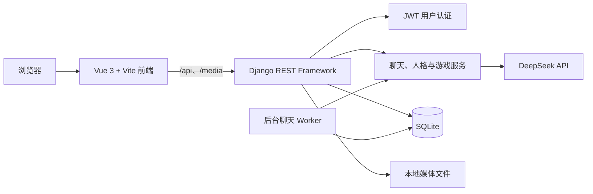

# WhatAI

WhatAI 是一个支持多 AI 人格互动的聊天模拟系统。用户可以创建具有不同性格和表达方式的 AI 人格，让它们参与群聊、进行一对一私聊，或一起游玩五子棋、成语接龙和飞花令。

## 系统架构



- **前端**：使用 Vue 3、Vue Router、Pinia、Axios 和 Vite 构建页面与交互。
- **后端**：使用 Django 5 和 Django REST Framework 提供用户、人格、群聊、私聊及游戏接口。
- **数据存储**：开发环境使用 SQLite 保存用户、房间、人格和消息等数据，上传的头像保存在 `backend/media`。
- **接口代理**：Vite 开发服务器将 `/api` 和 `/media` 请求代理到 `http://127.0.0.1:8000`。
- **身份认证**：用户登录后通过 JWT 访问需要认证的接口。
- **AI 对话**：群聊和私聊服务根据人格、场景及历史消息构造提示词，并调用 DeepSeek API 生成回复。
- **后台任务**：使用普通的 `runserver` 启动 Django 开发服务器时，群聊 Worker 会在自动重载进程中一并启动，负责安排 AI 发言并生成群聊消息，无需另开 Worker 终端。

## 功能

- **用户系统**
  - 注册、登录和登录状态校验。
  - 修改昵称和头像。
  - 选择 `deepseek-v4-flash` 或 `deepseek-v4-pro` 作为聊天模型。
- **AI 人格库**
  - 使用内置人格。
  - 创建、编辑和删除自定义人格。
  - 配置人格名称、头像、简介、说话风格和人格提示词。
- **群聊模拟**
  - 创建包含 2–4 个 AI 人格的群聊。
  - 设置群聊名称和对话场景。
  - 用户可选择以自己身份加入群聊，且不占用 AI 人格名额。
  - 查看消息、发送消息、引用回复，以及暂停或恢复 AI 自动发言。
- **一对一私聊**
  - 选择已有 AI 人格开始私聊。
  - 在创建私聊时快速新建人格。
  - 查看和删除私聊会话。
- **AI 游戏**
  - 五子棋。
  - 成语接龙。
  - 飞花令。

## 如何使用

以下命令以 Windows PowerShell 为例。

### 1. 环境要求

- Python 3.11
- Node.js `20.19+`（或 `22.12+`）
- npm
- DeepSeek API Key

### 2. 配置后端环境变量

进入后端目录，并根据示例文件创建本地配置：

```powershell
cd backend
Copy-Item .env.example .env
```

编辑 `backend/.env`：

```dotenv
DEEPSEEK_API_KEY=你的_API_Key
DEEPSEEK_BASE_URL=https://api.deepseek.com
```

`DEEPSEEK_BASE_URL` 是可选配置，不填写时会使用 `https://api.deepseek.com`。为兼容旧配置，项目也会读取 `DASHSCOPE_API_KEY`，但建议使用 `DEEPSEEK_API_KEY`。

### 3. 准备并启动后端

首次运行时创建虚拟环境并安装依赖：

```powershell
cd backend
python -m venv .venv
.\.venv\Scripts\python.exe -m pip install -r requirements.txt djangorestframework-simplejwt Pillow
```

初始化数据库：

```powershell
.\.venv\Scripts\python.exe manage.py migrate
```

启动 Django 开发服务器：

```powershell
.\.venv\Scripts\python.exe manage.py runserver
```

后端默认运行在：

```text
http://127.0.0.1:8000
```

正常使用上述 `runserver` 命令时，群聊 Worker 会随开发服务器自动启动。请保持该终端窗口运行。

### 4. 准备并启动前端

另开一个 PowerShell 窗口，在项目根目录执行：

```powershell
cd frontend
npm.cmd install
npm.cmd run dev
```

前端默认运行在：

```text
http://localhost:5173
```

在浏览器中打开该地址，注册并登录后即可使用。

> PowerShell 可能因执行策略阻止 `npm.ps1`，因此本文统一使用 `npm.cmd`。

## 开发检查

检查后端配置：

```powershell
cd backend
.\.venv\Scripts\python.exe manage.py check
```

构建前端：

```powershell
cd frontend
npm.cmd run build
```

## 注意事项

- 本项目当前配置面向本地开发与演示，不建议直接用于生产环境。
- Django 开发服务器的自动重载机制负责启动群聊 Worker；使用 `--noreload` 时不会自动启动该 Worker。
- 前后端服务需要同时保持运行，前端页面才能正常调用接口和加载媒体文件。
